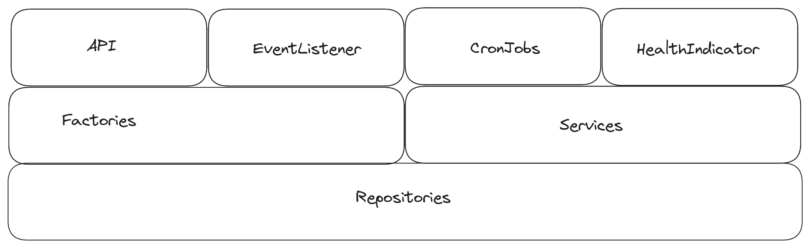

# Managed Identity Wallets App

## Overview

### Invoker Components

The system comprises four distinct component types, each activated under specific conditions to potentially alter the
application's state:

- API
- Event Listener
- Cron Jobs
- Health Indicator

### Business Components

These components have the ability to invoke factories, generating essential objects to execute their designated tasks.
Utilizing these objects, they can access required services to fulfill their functions.

### Persistence Components

Services initiate interactions with repositories to persist newly created or updated application states.

## Directory Structure

| Directory        | Description                                                                                | Further Documentation                                                | 
|------------------|--------------------------------------------------------------------------------------------|----------------------------------------------------------------------|
| `/annotations`   | The annotations directory contains all custom annotations used throughout the application. |                                                                      |
| `/api`           | The api directory contains all REST API controllers.                                       | [Application API Documentation](./documentation/api)                 |
| `/command`       | The command directory contains all command classes.                                        |                                                                      |
| `/config`        | The config directory contains all configuration classes.                                   |                                                                      |
| `/cron`          | The cron directory contains all cron job classes.                                          | [Application Cron Documentation](./documentation/cron)               |
| `/event`         | The event directory contains all event classes.                                            | [Application Events Documentation](./documentation/events)           |
| `/eventListener` | The eventListener directory contains all event listener classes.                           | [Application Events Documentation](./documentation/events)           |
| `/exception`     | The exception directory contains all exception classes.                                    |                                                                      |
| `/factory`       | The factory directory contains all factory classes.                                        |                                                                      |
| `/health`        | The health directory contains all health indicator classes.                                |                                                                      |
| `/models`        | The models directory contains all model classes.                                           |                                                                      |
| `/repository`    | The repository directory contains all repository classes.                                  | [Application Persistence Documentation](./documentation/persistence) |
| `/service`       | The service directory contains all service classes.                                        |                                                                      |
| `/util`          | The util directory contains all utility classes.                                           |                                                                      |
